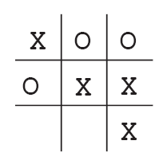
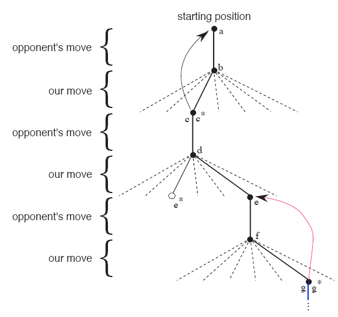

# 1. 什么是强化学习？

我们经常会思考人类是如何学习的。比如一个刚刚出生的婴儿，通过用手
去触摸物体，或者用眼睛看整个世界，在这个过程中并没有人指导他，
这时学习的方法就是通过与环境进行交互。因此从与环境的交互过程中
学习是一种显而易见的人类学习的方法。甚至可以认为，**从交互中学习
是几乎任何学习理论(Learning Theory)和智能理论(Intelligence Theory)的基本观点。**

强化学习(Reinforcement Learning， RL)就是考虑怎么做才可以最大化奖励(Reward)，这个奖励是需要用数值来衡量的。换句话说，就是需要知道在什么状态下我们应该执行什么动作。
人们并不是直接知道在哪种状态下应该执行哪种动作，而是通过尝试，找到一个可以得到最大奖励的动作。一般情况下，选择了一个动作之后不仅会决定
我们当下会得到的奖励(Immediate Reward)，还会决定我们会进入哪一个新的状态，进而影响我们后续所有应该得到的奖赏，这个叫做
延迟奖励(Delayed Reward)。因此，**试错(Trial-and-error)和延迟奖励(Delayed Reward)是强化学习的两个最重要特征**

在强化学习中，一个智能体(Agent)--可以理解成一个人或者机器--必须可以感知环境并且能够通过一些动作改变状态。同时，智能体需要有目标，就是
明确自己的目的是什么。马尔科夫决策过程(Markov Decision Processes)包括上面三点要点（包括感知、动作、目标）。任何能解决这个问题的
方法都可以认为是一个强化学习方法。

# 2. 强化学习是一种机器学习范式

有人说机器学习分为监督学习和无监督学习，并且把强化学习当作是一种无监督学习问题。但是实际他们是完全不同的。
下面介绍下强化学习、监督学习、无监督学习的区别所在。

首先，强化学习不同于监督学习。监督学习相当于对于每一个状态都能知道最优动作是什么（即label），他的目标是探索那些没在训练集中出现
的样本的正确动作。这确实是一种非常重要的学习方式，但这不能够从交互中学习。在交互问题中，一般很难得到每种状态下又准又好的明确行为。
因此Agent通常是通过自己的经验来学习如何得到更大奖励的。

其次，强化学习不同于无监督学习。无监督学习的目的是找到无标签数据中隐藏的结构，比如社团发现等问题，而强化学习目的是最大化奖励，
不是找到数据的隐含结构信息。虽然结构信息可能对强化学习有帮助，但是这不足以使Agent得到最大奖赏。

因此，强化学习应该看作是与监督学习、无监督学习并列的一种机器学习范式(Paradigm)。

同时，在强化学习中会遇到一个挑战：如何平衡探索与利用(Trade-off between exploration and exploitation)，这是在监督学习和无监督学习中
不存在的一个挑战。这也称为探索-利用困境(Exploration-exploitation dilemma)。其实探索-利用困境意思就是我们既想利用我们以前找到过的比较
优秀的动作（就是可以得到更好的即时奖赏），又想尝试没有尝试过的动作去探索更好的动作。

# 3. 强化学习要素

除了智能体和环境，强化学习有4个重要元素：**策略(Policy)、奖赏信号(Reward Signal)、值函数(Value Function)、模型(Model)(可选)**

策略就是一个智能体在特定状态下应该采取什么对应的动作。对应于心理学上的一个概念就是“刺激-反应规则”或者“刺激-反应关联”
(Stimulus-response rules or associations)。策略可以有多种形式，比如可以是一个简单的映射函数或者可以查表得到(lookup table)。意思
就是在表格中找到当前的状态，然后去查对应的动作。策略还可能需要大量的运算，比如在动作空间中去搜索最佳动作。

可见策略其实是智能体与环境交互的核心内容。一般来讲，策略是随机的(Stochastic)，意思就是对于一个具体状态，动作并不是确定的，可能是每个
动作有一个概率。比如一个智能体在迷宫的某一个位置，这个位置就是当前的状态，然后这个智能体通过查表，发现有80%的概率向上走，有20%的概率向
又走。

奖赏信号定义了一个强化学习问题的目标。在每一步，环境会给智能体一个奖赏(Reward)，智能体的目标就是最大化长期奖赏。而奖赏信号就是指这个奖赏对智能体是好是坏。
以后我们就将奖赏信号等价于奖赏来看。奖赏本身也是Stochastic的，即对于在特定状态下选择特定动作，所得到的奖赏也是服从某个概率分布的。

奖赏衡量了智能体当前感知的好坏程度。而值函数(Value Function)则衡量长期奖赏的好坏。状态的价值(Value)就是智能体对于从当前状态开始，未来能获得的
总的奖赏的期望。因此当前奖赏大不代表未来获得的总奖赏大，当前奖赏小不代表长期奖赏小。因此奖赏就相当于我们眼前的即时利益，价值就相当于我们对长远收益
的判断。奖赏来自智能体的感知，价值来自对未来的奖赏的预测。没有奖赏就没有价值，而估计价值的唯一目的就是获得更多的奖赏。强化学习的目标是获得更大的价值，而
不是获得更大的奖赏。

因此看起来思路很清晰了，我们只需要找到价值最大的状态就好了。不幸的是，决定状态的价值到底是多少是一个很难的问题。奖赏是环境直接给出的，而价值需要
智能体根据自己以往的经验不断的评估和重新评估。因此**我们考虑任何强化学习问题的最重要部分就是如何高效的评估价值。** 这也是过去几十年强化学习的主要研究点。

最后一个强化学习系统的组成成分就是环境的模型(Model)。模型用来模拟环境的行为，即给定当前状态和要执行的动作，模型可以预测出下一个状态和将要得到的reward。
模型用来做计划(Planning)，意思就是我们在实际尝试之前，根据模型考虑未来可能出现的情况，从而决定未来的系列动作。使用模型和计划的方法称为**基于模型的方法(Model-based methods)**
，反之，通过试错、不使用模型的方法称为**免模型的方法(Model-free methods)**。

# 4. 本书的局限性和范围

通过前面的了解，我们知道状态--作为策略和值函数的输入以及模型的输入输出--对于强化学习是非常重要的。我们可以把状态看作在某一时刻环境传递给智能体的一个信号，表示
当前环境是怎么样的。但是本书不涉及如何构建、设计状态信号，重点是关注决策问题。

书中考虑的大多数强化学习方法都围绕估计价值函数，但是要知道并不是所有方法都必须估计价值函数。比如使用进化算法(Evolutionary algorithm)，比如遗传算法、模拟退火等方法，
解决强化学习问题，但是不需要估计家值函数。该类算法是使用很多个智能体，采用不同的策略与环境交互，然后选择可以得到更大奖赏的智能体，不断迭代。进化算法可以用于智能体无法完全
感知环境的问题。但是本书并不讨论进化算法的使用。

# 5. 举例--Tic-Tac-Toe(井字游戏)
井字游戏类似于五子棋，只是这里只是3*3的方格，横竖斜只要连成3个就算赢。如下图所示。

这个游戏的高手是不可能输的。这里我们假设我们与一个不太厉害的对手进行对弈，下面我们看使用
价值函数的方法是怎样进行的。

首先我们定义一个表格，表格中每个格表示井字游戏中的一个状态。这个格子的值表示我们对在当前状态下，最后能赢的概率的最新估计，这个估计的值实际
就是状态的价值(Value)，整个表格就是要学习的价值函数。比如状态A的值大于状态B的值，表示我们在当时认为从A状态能赢得比赛的概率要大于在B状态下能赢得比赛的概率。
假设我们是X玩家（下棋用X，另一个人用O），那么对于赢了的状态，这些状态的值就是1，因为已经赢了；对于对手赢了的状态或者平局的状态，这些状态的值就是0，因为我们在
这些状态下不可能赢。初始情况下，其他任意状态的值都是0.5，即我们认为在这些状态下赢得比赛的概率都是50%，因为我们当前从来没玩过，对于比赛的局势判断只能到达50%这个精度了。

假设下一步到我们下棋了，这时我们需要评估当前每个没有放子的位置，如果将当前子放到某一个位置的状态值最大，我们就选择当前的下法。但是很显然我们这时只能下我们走过的方法，
无法探究新的状态，有可能新的状态的值更好，只是我们没遇到而已。为了遇到这些更好的状态，我们需要以一定的概率随机选择一个位置下棋，这个叫做探索性的移动(Exploratory moves)。
整个移动过程示意图如下图所示：

这里起始状态是a，带星的状态是当前最优状态值。我们的第二次选择是一次探索性选择。即当前我们在d状态，应该移动到e\*状态才是最优选择，但是这时我们随机选择了一个状态e，然后
对手移动到了状态f，这是我们选择最优状态g\*，假如g\*状态时的状态值是0.9，而e状态的状态值是0.4。这说明，其实g\*状态已经很接近于赢的状态了，但是由于e状态估值不好，因此导致
我们没有选择过e状态，进而导致无法进入g\*状态，问题出在哪里呢？问题就在于我们对于e状态的估值不准确，或者说按照之前的经验，我们可能没有进入过e状态，无法进行准确估计，因为
这一次探索性尝试，我们选择了e状态，然后发现后面可能得到更好的状态估值。所以这里我们应该更新状态e的状态值。同理，贪心策略下也是同样的思路，需要更新之前的状态值。

因此如果我们假设$s$表示贪心之前的状态值，$s'$表示移动之后的状态。$s$的状态值估计更新规则如下：
$$
V(s) \leftarrow V(s) + \alpha [V(s')-V(s)]
$$
