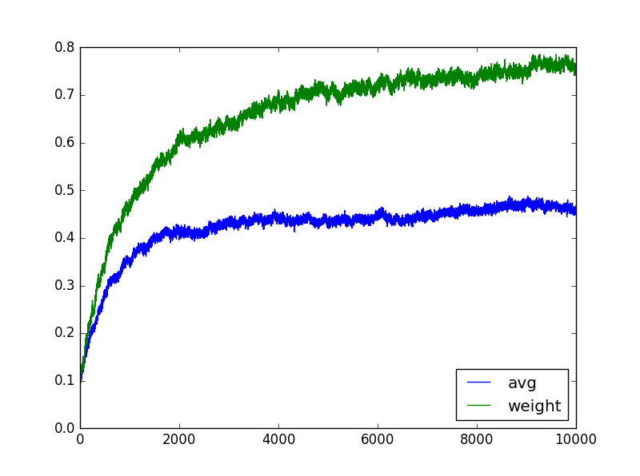

# Multi-armed Bandits

---

# 1. Evaluative or instructive feedback

强化学习区别于其他学习方法的最重要一点就是：**强化学习使用训练信息去评估(Evaluate)动作而不是根据正确的动作去指导(Instruct)动作**。
下面介绍两个概念评估性反馈(Evaluative feedback)和指导性反馈(Instructive feedback)。

纯的评估性反馈就是会告诉我们当前采取的动作有多好，但是不能告诉我们当前动作是不是最好的或者最坏的动作；而纯的指导性反馈完全独立于我们
当前采取的动作，只能告诉你最好的动作是什么。可见这是两种完全相反的模式：评估性反馈完全依赖于当前选取的动作，但是指导性反馈完全独立于
当前选取的动作。

这一章主要讲述多臂老虎机(K-armed bandits)的一个简单版本，这里只有一个状态，不涉及复杂的状态转移等问题，是一个非关联(Nonassociative)的设置。
这样做也是为了简化强化学习问题，更能理清楚评估性反馈与指导性反馈的重要区别是什么。在这一章结尾，作者花了一节的篇幅介绍了赌博机问题编程关联的
(Associative)情况，也就是说，需要考虑在多个情况下采取动作的情况。

# 2. 什么是多臂老虎机问题(K-armed bandit problem)

多臂老虎机问题可以这样理解：摆在你面前一个有k个摇臂的老虎机，你可以从k个摇臂中随机选择一个按下去，然后老虎机根据你选择的动作，按照一个稳定的
概率分布(Stationary probability distribution)反馈给你一定的钱。你的目标就是在玩一定次数或之间内，比如玩1000次内，取得最大的总期望。

下面我们要一点一点的分析并定义这个问题。

在多臂老虎机中，我们可以认为动作空间大小为k，即我们从k个摇臂中选择1个。当一个动作被选择之后，即我们按下了其中一个臂之后，老虎机会按照某个
稳定的概率分布随机返回给我们奖赏，虽然奖赏是随机的，但是由于是来自一个稳定的概率分布，因此期望是稳定的，我们把这个期望称为这个价值(Value)。

我们定义在时刻t选择的动作是 
, 对应获得的奖赏(Reward)是
。因此任意动作a的价值
)就是选择动作
a获得的奖赏的期望。即：

\doteq E[R_t|A_t=a])

假设我们知道那个臂出的钱的期望值最大，那我们只需要每次都按那个出钱最多的臂就行了，这样我们肯定会获得最好的奖赏。但是问题在于每个臂出钱的概率
分布我们是未知的。因此我们只能根据经验，来对动作的价值进行估计。假设在时刻t我们对动作a的价值的估计为
)。我们希望这个估值能接近于
)。

这里之所以有下标t，表示我们在每一个时间都会获得新的经验，把新的经验应用上去更加准确的估计动作的价值。因此实际我们对动作价值的估计是在不断更新的。

在这个问题中，如果我们每次都选择当前估值最大的动作，即贪心(Greedy)动作，这就是利用(Exploitation)你当前对于所有动作的估值。但是只这样做是不好的，
因为可能有和估值最大的动作估值差不多的其他动作，但是它的估值还不稳定，可能它的准确价值应该高于当前最优动作。因此我们应该对这种情况进行探索(Exploration)。
这就是要去选择那些非贪心(Non-greedy)的行为，然后对这个行为进行估值。换句话说，利用的过程其实就是贪心的过程，贪图当前的短期利益；而探索的过程
其实就是不去追求短期利益，而是为了更好的让长期利益最大。但是我们对于一个动作不可能既是探索，又是利用，因此我们需要平衡探索和利用的关系。

现有很多很复杂的方法用来解决平衡问题，但是大多数都做了很强的假设，因此这里我们只考虑一些简单的平衡(Balance)方法。在多臂老虎机上可以看到清晰的形式。

# 3. 动作-价值方法(Action-value Methods)

注意我们动作的真实价值定义
)
就是动作被选择所获得的奖赏的期望。因此一个很自然的想法就是使用所有之前的实验中选择当前动作的奖赏均值来估计动作的奖赏。公式如下

根据大数定律可知，当选择当前动作的次数趋于无穷的时候，
)可以收敛到
)。
这种方法称为采样平均法(Sample-average)。

有了对每个动作价值的估计，我们就可以选择动作了。最简单的动作选择方法就是选择估值高的动作，其实就是贪心的选择。可以用公式表示为：

)

但是我们还需要exploration，因此我们可以采用一种简单的策略：大多数时候我们贪心选择动作，只有很少的时候，比如一个
小的概率

我们随机(randomly)选择动作。这种近似贪心的动作选择方法，我们称为
。

# 4. 10臂老虎机实验平台(The 10-armed Testbed)

为了方便的比较实验效果，我们决定实现一个多臂老虎机平台。我们使用2000个随机生成的10臂老虎机进行实验。
对于每个老虎机，每个动作的真实价值按照N(0,1)的分布随机生成。对于在t时刻选择的动作

，老虎机返回的奖赏大小按照以
)
为均值，方差为1的随机分布产生奖赏反馈给我们。下面我们将尝试

设置成不同值时的累计奖赏。当设置成0是表示完全贪心。

根据上述设置编写[代码](../codes/2_Multi_armed_Bandits)，得到每一步的平均奖赏和每一步的最优动作选择率的图示。
实验中

设置为0, 0.01, 0.1, 0.5, 1, groundtruth这五种情况。groundtruth意思就是上帝视角，每次都选择最优动作。

首先展示平均奖赏图示

图中可以看出如果完全利用(Exploitation)，那么最后将会得到平均为1的奖赏。如果完全探索(Exploration)，则表示永远随机选择动作，
因此最后的平均奖赏为0。这里可见最优的

选择方案就是0.01，同时不是越高越好或者越低越好，可以通过实验测得。

下面展示最优动作的选择比例图示

这里groundtruth的最优动作选择比例永远是1。

可以看出，

为0.1的时候可以80%左右的准确率。所以可以看出

的选择不应该太大也不应该太小，应该通过测试得到。

需要注意的是当

为0.5时，最优动作选中的概率也是0.5，但是平均奖赏还不如完全贪心。

# 5. 增量实现(Incremental Implementation)

实际在上面的实验平台的代码实现中，已经使用了增量实现的方式。因为前面已经说了，我们采用的估值方法就是简单的采样平均法，
这里就是探讨如何高效的实现这种采样平均算法。

假设：

表示第i次选择某一个确定的动作所得的奖赏，假设到目前为止已经选择了n-1次这一动作，
因此可以根据上面所讲的得出这一动作的估值为：

假设当前再次选择了这一动作，并且得到了

的奖赏。在获得奖赏之后的这一动作的新的估值可通过下式计算：

同时可以看出当n=1时，

，无论

为任何值。

上面的式子其实可以抽象出一个通用的更新规则(Update rule)，如下式所示：

其中*Target-OldEstimate*表示估计的误差(Error)，为了把这次实验的经验加入到我们的估计中，我们使当前估计想着这次的实验的奖赏移动一小步，
这一小步就用*StepSize*表示。

在这里我们一般定义步长为
，其实应该是
)，但是一般无论当前是第几步还是选择的第几个动作，步长一般设置成一样的，一般是

# 6. 考虑不稳定的情况(Tracking a Nonstationary Problem)

前面讨论的估值方法主要适用于稳定的老虎机问题(Stationary bandit problems)，意思就是奖赏的概率分布是确定的，不会改变的。
假如我们的概率分布是改变的，我们就更应该关注于当前获得的奖赏，而不是原来的奖赏，因为最近的奖赏对新的奖赏会更有影响。
一种很常见的方法就是使用固定(Constant)的步长参数（注意之前的步长参数与n是相关的）。公式为

其中
)
是一个常数。为什么步长为常数就可以使估值更加重视最近的奖赏呢？其实可以进行下面的推导：

可以证明，

表示其实新的估值是以前所得奖赏的加权平均。并且权重和为1。同时可以看出越近的奖赏，n-i越小，因此权值越大。
当

时，表示估值只需看最近的奖赏值。注意

这种方法叫做**指数最近加权平均(Exponential recency-weighted average)**。

有时候我们希望步长是随着时间变化的，这时步长就用
)
表示。比如之前的采样平均法，
=\frac{1}{n})。
这可以由大数定律保证估值收敛到真正的动作价值。但是**不是所有的变化步长都能保证最终的收敛**。

那到底什么时候才能收敛呢？或者步长满足什么条件是才能保证收敛呢？这里随机近似理论(Stochastic approximation theory)告诉我们：
只要满足下面的两个公式，就可以保证最终以概率1收敛到真正的动作价值。条件如下：

<ceter>

其中的第一个公式保证步长要足够大，以便于能够克服初始的随机值和波动；第二个公式保证步长要足够小，以便于保证能收敛到真正的动作价值。

由高等数学的知识就可以证明之前的采样平均满足这两个等式。

但是，**当步长为固定值时，无法满足第二个条件**，这也就说明固定步长为常数的方法不能够完全收敛，而是随着最近的奖赏不断变化。

虽然说理论上需要满足上面的两个条件才可以收敛，但是由于现实情况中不稳定问题经常出现，并且即使稳定，满足条件的情况的收敛速度很慢，并且需要
很好的调优过程才能得到较好的收敛速度。 **因此在实际应用中很少要求步长必须满足上面的条件**。

下面我们对于不稳定情况，使用前面的试验台进行模拟，实验设置所有动作的真实价值都是0，在每一次选择之后，对于所有动作的真实价值加上一个服从
N(0, 0.01)的噪声。我们使用的动作估值方法有两种，一种是采样平均法，另一种是指数最近加权平均法。对于后者设置步长恒定为0.1。整个实验设置
。实验步长为10000步。 

最终得到平均奖赏示意图为：

可以看出权重更新法的平均权重要由于采样平均法。

从最优动作选择的概率上看，

可见加权更新的方法命中最优权重的概率较大，而采样平均法由于更新速度较慢，因此不太能跟上非稳态的变化速度，因此效果差一点。

# 7. 乐观初始值技术(Optimistic Initial Values)

要注意我们之前的讨论都没有考虑在估计动作价值时的初始值。在实现中我们只是简单的把所有的初始值都赋值为0，初始值的不同可能对我们最后的结果
产生影响，这个叫做偏差(Bias)。

对于采样平均法，偏差将会在每个动作都尝试过一边之后消失，因为我们之前说过，所有的

,这就说明了只要我们每个动作都尝试了一边，那么

无论为什么值都不要紧。

但是对于步长固定的方法就不是了。因为根据我们上面的推导可以发现，
是由

推导出来的。因此无论什么时候，偏差都是永远存在的，尽管偏差会随着时间的推移而不断降低。

在实际中，偏差其实不算是问题，同时可能还能够帮助我们得到更多的奖赏。比如我们可以通过初始值引入先验知识等等。

我们这里要介绍的乐观初始值技术。这是一种鼓励探索(Exploration)的方法。比如实验中，我们设置的动作的价值是服从N(0,1)的。
可见奖赏值不会很大。我们直接设置我们对动作的估值是一个非常乐观的数字，比如+5。这就是说，无论我选择哪个动作，得到的奖赏都不会超过这个值。
至少要把每个动作都尝试几次之后才能降到一个比较合理的返回，这也就鼓励了我们的探索。下面我们做一个实验来展示乐观初始值的效果。

下面我们借用之前做的实验。只是把纯贪心的方法，初始值设置为+5，并且是在stationary的情况下工作的。由于初始值在探索一遍动作之后是无偏的，因此
我们采用的方法是步长固定的方法

平均奖赏示意图为：

<ceter>

最优动作选择概率为：

<ceter>

可见最后贪心算法的最优动作选择的概率还要高于
方法。

**注意乐观初始值技术不是一种通用的鼓励exploration的技术,只能用在stationary的问题中。**

在应用乐观初始值之后，我们发现在运行初期，存在一个很大的向上的峰值。这个是什么原因呢？
我的理解是这样的：应用乐观初始值之后，我们肯定都是要先全部探索一遍，然后再继续寻找。但是可能
在选择最优动作时，估值减小的幅度比较小。可能最优动作选择几次之后，估值才和其他的降到同一水平。
因此在初期会出现一个峰值，就是大家都好像找到了最优的动作值，但是这个时候其实估值还没降到一个合理
的水平，因此最后还会继续探索，直到稳定。

**这是我的个人看法，并不一定完全正确。**

# 8. 置信上界动作选择法(Upper-Confidence-Bound Action Selection)

首先，我们必须明确，exploration是非常有必要的，是因为我们对于动作的估值总是存在不确定性。贪心算法是选择眼下最好的动作，但是可能
存在其他的动作实际更好，只是我们的估值不太准确导致没有选中这个动作。

方法表示有一个较小的概率非贪心(non-greedy)的选择动作，但是这次非贪心的选择对于那些接近最优估值的动作或者差的远的动作没有任何偏好。

如果既考虑到目前的估值又考虑到不确定性，下面这种动作选择的方法可以高效的做到这一点。

<ceter>

这种方法称为UCB方法。其中t表示当前是第t次选择。
)
表示在前t-1步中，选择动作a的次数。c用来控制置信水平(confidence level)。

可以看出，上面式子中的根号下的东西是核心部分，这是用来衡量不确定性(uncertainty)的。随着时间的推移，分子
逐渐增大（可以到达无穷大），假如动作a很久没有被选择过了，分母不变，这时其实不确定性增大了，
因为我好久没有对动作a重新评估了。因此根号的值变大，所以被选中的概率会升高。

或者假如一个动作经常被选中，比如稳定之后的最优动作，这里分子分母都在增大，但是分母增大的更快。
因此右边项的值变小，最后这个动作被选中的概率就会变小。

所以，所有的动作都会被尝试，当一个动作的不确定性变大时，这个动作被选择的概率就会变大；
当一个动作经常被选择时，这个动作被选择的概率就会变小。

这种方法在我们的老虎机试验台上测试的效果还算不错，但是UCB方法比

方法更加难以扩展到更加复杂的问题上。原因是UCB很难应用到非稳定的问题上，同时很难应用到状态空间很大的问题上。
因此UCB动作选择方法一般不会应用到更加复杂的问题上面。
具体的平均奖赏与最优动作选择概率图示如下图所示。其中图例中的-1表示的就是使用UCB方法进行动作选择的方法。

<ceter>

经过尝试，如果使用步长固定的算法，UCB与普通的

方法效果是差不多的。

# 9. 梯度老虎机算法(Gradient Bandit Algorithms)

到目前为止，我们讨论了如何对动作进行估值（采样平均、加权平均），并且讨论了如何根据我们的估值选择动作（贪心、epsilon-greedy、UCB）。
虽然这是一个很好的思路，但是这并不是唯一的方法。这一节我们对动作a定义一个偏好值(numerical preference)
)
，这个偏好值越大，说明动作a被选中的概率最大。注意这个偏好值并不是奖赏，与奖赏无关。我们不对每个动作估计价值。
这个偏好值只是一个相对的概念。一个动作的偏好值比另一个的大表示这个动作相对于另一个动作更加重要。即使把每个动作的偏好值都加上1000也对这种
相对性没有影响，也就是对每个动作被选中的概率没有影响。而每个动作被选中的概率如何定义呢？这里就可以使用softmax函数。定义如下：

\doteq\frac{e^{H_t(a)}}{\sum_{b=1}^ke^{H_t(a)}}\doteq\pi_t(a))

这里定义的
)
表示在第t步时选择动作a的概率。

由随机梯度上升的观点，可以得到
)
的更新方法如下：

其中

表示步长(step-size)参数。

表示包括当前时刻t所获得的所有奖赏的平均值。它的目的就是作为一个baseline，也就是一个衡量标准。如果选择了某个动作之后，
得到的奖赏高于之前的平均奖赏，那么我们将来选择这个动作的概率将会变大。如果当前获得的奖赏低于baseline，则我们就向以后
尽量不选择这个动作。上面两种情况中的其他动作都是与这个被选择的动作概率更新方向相反。意思就是如果我们希望这个动作被选中
的概率变大，就表示我们希望其他动作被选择的概率变得更小。这个有点像后面的策略梯度法(Policy Gradient)。

注意奖赏的变化对于梯度老虎机算法是没有影响的，因为baseline会及时更新。 但是如果我们直接把baseline设置成0，就是忽略
baseline，那么的得到的效果将会差很多。具体有无baseline的差别可以见下图。

上图中我们设置的动作的价值的均值是+4而不是0。

为了理解上面的更新规则是怎么得到的，我们可以把问题理解成对于梯度上升问题的随机近似(stochastic approximation)。

其实我们在t时刻的目的是使在这一时刻我们能获得的奖赏最大。 因此这里面目标函数就是t时刻获得的奖赏

,初始的自变量（也就是参数）就是各个动作的偏好值，中间变量就是每个动作被选择的概率。

我们的目标是选择一组合适的各动作偏好值，使这一时刻的奖赏最大。因此这时一个梯度上升问题(Gradient Ascent)
因此我们的更新规则就是

其中奖赏的期望可以定义为：

这个期望其实是总体期望，但是关键问题是我们并不知道每个动作的价值
)
。下面我们要着手替换掉这一项。

首先，我们对梯度进行进一步推导得到：

下面我们要考虑的就是如何计算公式中的这个偏导。

这里

表示一个不依赖与动作的任意一个标量值。之所以可以这样直接减去一个值，是因为

}{\partial H_t(a)}=0)

其实这里求和的部分就是每个动作被选择的概率的变化幅度。有些概率增加，有些概率减少，但是因为是概率，最后无论怎么加减，
和应该保证为1，因此所有变化的和应该是0。

其实这里也可以看出，不减去这个

也是可以的。

对上式做一个简单的变化得到：

这样变换的目的其实就是要继续转化为概率分布，因此可以继续推导得到

上面推导的最后一步进行了替换。因为

是与动作无关的标量，因此定义为前面所说的

。而使用

替换
)
其实也是可以的，主要因为
)
。

我认为这里实际就是近似替换，使用实际得到的奖赏来估计真实价值。在统计意义上讲是成立的。只是个人见解。

现在只剩下一个偏导没有计算了，这个计算方法实际就是softmax的求导方法。这里先给出求导的结果为：

代换公式中的偏导可得：

因此可得参数的更新规则为：

这个其实就是上面给出的更新公式。

整个过程到此就推导完了，但是还有一点就是softmax函数的推导，即上面的

为什么是成立的。这里参考softmax求导的过程，就不再具体介绍了，直接给出推导过程如下：

虽然baseline可以是任何不依赖于动作的值，比如可以设置成0或者1000或则和其他的都无所谓。它不会影响算法的更新过程。
但是它能影响更新的幅度。比如假设我们所有获得的奖赏都是大于0的，这时我们设置baseline就是0。那么对于一个很差的选择，
因为它的奖赏仍然是正数，
我们当前选择的概率都会增大，只是增大的幅度比较小可能。只能依靠更好的动作被选中时更大的提高自己被选中的概率来压低其他
不好的动作。这个就导致了更新的方差(Variance)比较大，从而导致收敛速度比较慢。

一种常用的方法就是使用当前所有得到的奖赏作为baseline，虽然这种方法不一定是最好的，但是这种方法简单而且效果还不错。

# 10. 关联搜索（上下文老虎机） (Associative Search, Contextual Bandits)

上面我们讨论的问题都是非关联(nonassociative)的问题，意思就是我们获取奖赏只与我们选择的动作有关，而且我们通过尝试得到了
老虎机的动作的估值，每次利用的时候我们只需要选择估值最大的动作就行了。动作与环境(situation)是无关的。

但是一般的强化学习任务中，都会多于一种状态，我们的目标是去学习一种策略，就是学习一个从situation到action的映射。
然后我们根据策略就可以知道在某个状态下，我们应该选择哪种动作。这时我们就需要根据不同的situation来选择不同的动作。
这就叫做关联(associative)的问题

下面我们简单的将老虎机问题扩展到关联(associative)的情况下。

举个例子，假如我们现在有一些不同的多臂老虎机，每个老虎机都是nonstationary的。现在环境首先随机分配给你一个老虎机，
然后让你去操作这个老虎机，这就算是完成了一次操作。我们的目的就是获得最多的奖赏。

但是这里显然得不到一个比较好的奖赏。因为我们根本不知道他随机的是哪个老虎机，我们之前的对每个老虎机的每个动作的估值显然也用不上了。

比如1号老虎机我们估计选择第5个动作最好，2号老虎机我们估计选择第3个动作最好，那现在我们不知道他随机给我们的是1号老虎机还是2号老虎机，
那我们就不知道该选择动作5还是动作3。

但是现在假设给你一些新的线索，比如你能够看到一个灯，可以红灯亮或者绿灯亮。如果亮了红灯，那就是告诉你后面就是1号老虎机；如果亮了绿灯，
那就是告诉你后面是2号老虎机。那有这个线索就很好了，我们就可以根据指示灯的颜色来决定我们选择什么动作。这样的累积奖赏肯定比什么都不告诉
你效果要好得多。

给你了这个红绿灯线索的这个问题就是一个关联搜索(Associative search)任务，之所以叫关联搜索是因为我们既需要通过试错(trail-and-error)来搜索(search)最优的动作，
还要把这些动作和状态(situation, 就是例子中的红绿灯)关联起来。这个任务在一些文献中被称为“上下文老虎机”问题(Contextual bandit)

上下文老虎机其实是一个介于简单多臂老虎机和一般强化学习问题之间的一个问题。上下文老虎机中我们选择的动作不会影响下一次亮红灯还是绿灯。
如果动作可以影响到我们下一步的动作和奖赏，那这就是一个一般的强化学习问题了。

# 11. 总结
这一章主要讲了一些平衡exploration和exploitation的方法。比如epislon-greedy, UCB, Gradient bandit algorithms。
那么一个很重要的问题就是到底哪个算法效果好，下面这个图是一个参数研究图(parameter study)，展示了每种算法的参数范围以及平均得到的奖赏，如下图所示。

蓝色的UCB曲线，表示的就是参数Q0为0.5的时候效果是接近最好的。这里每个曲线都对应不同的参数，只是把他们放到同一个x轴上面了。
因此这里可以看出其实UCB的效果是最好的。这次实验是在staionary的情况下做的。因为比较懒我也不想再写这个实验的代码了，并且没有在non-stationary的情况下复现。
主要是这个还要进行很多次实验，很麻烦才能得到这张图。

同时从图上可以看出，这几种算法都对参数不敏感(insensitive)，就是在参数范围内表现的都还不错。

当然我们这一章介绍的平衡方法虽然还不错，但是远不是一个非常满意的结果。有很多研究关于于如何对于多臂老虎机问题平衡exploration和exploitation。
比如Gittns indices, Bayesian method (posterior sampling or Thompson sampling)等等，这些方法就暂时不再介绍了。