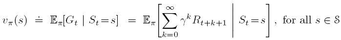

# 有限马尔科夫决策过程(Finite Markov Decision Processes)

---

从这一章开始，为了更加明确一些专业概念，我们将对一些专业概念直接使用英文表述，这样不太容易混淆。

上一章的最后我们定义了上下文老虎机，这是一个介于简单的多臂老虎机和一般强化学习之间的一个问题。
这一章我们将会给出一般强化学习问题的形式化表示（就是通过有限MDP来表示的）。那到底一般的强化学习问题
都需要包括哪些要素呢？首先，类似于老虎机，需要有evaluative feedback；其次是一个associative的问题。
意思就是我们在不同的situation应该选择不同的action；最后一点就是我们选择了某一个action之后，action不止
会影响当前奖赏(immediate reward)，还会影响后续的situation（或者state，状态）以及未来的奖赏。
因此MDP涉及到了即时奖赏和长期奖赏，需要在这两者直接做出平衡(tradeoff)。

在老虎机问题中，我们对每个动作a估计他的价值
)
。但是在MDP中，问题是associative的，需要根据当前的state选择action。因此在MDP中我们需要估计在每个状态s下
选择每个动作a的价值，记为：
)。当然我们也可以对state给出估值，这个估值就可以认为是
在这一状态下，选择最优动作时候的价值，这里记录为：
)

下面我们将具体介绍如何定义一般的强化学习框架。

# 1. 智能体-环境接口(The Agent-Environment Interface)

MDP是一个从交互中完成某一特定目标的一个很容易描绘的框架。做出决策的决策者称之为智能体(Agent)。与agent交互的所有agent外部的概念
称之为环境(Environment)。在agent与environment连续交互的过程中，agent选择一个动作，然后environment根据所选动作反馈给agent一个reward，
并且进入一个新的state。agent的目的就是找到怎样才能最大化长期的reward。交互过程如下图所示。

具体来讲，我们假设agent与environment交互为离散的时步(Time Step)t=0,1,2,3...。在每个时步t。
agent会受到一个environment给出的state，

，在这个state的基础上，这个agent选择一个action，
)
。完成动作后，agent会受到一个数值reward，

,并且agent这时会发现自己进入了一个新的状态，

。注意：这里奖赏的下标是t+1，这个是为了强调
与

是同时确定的。但是很多文献中使用的是
来表示获得的reward，但是注意，
我们在书里面使用的是

表示在t时刻执行完action之后获得的reward。

因此最后我们得到了一个序列或者叫做轨迹(Trajectory)：

而在有限MDP中，状态、动作、奖赏集合都是由有限个元素组成的。
因此对于随机变量
与
可以使用离散的概率分布定义。
因此我们定义在t-1时刻agent所处状态是s，选择了动作a，将会转移到状态s'并返回奖赏r的概率为：

\doteq Pr(S_t=s',R_t=r|S_{t-1}=s,A_{t-1}=a))

这里的函数p是概率，也是一个映射：

，这是一个由四个参数组成的确定性函数(Deterministic function)。

因为是概率，所以必然满足概率和为1，因此可以得到：

根据上面的公式就可以定义任何我们想要从环境中了解的信息了。比如
+ 状态转移概率(State-transition probabilities)

+ 状态-动作对的期望reward

其实状态动作对的期望reward这个公式可以这样看，比如我们要找给定s,a,计算奖赏为r的概率。那就类似
上面的状态转移概率的计算方法，就是
=\sum_{s'\in S}p(s',r|s,a))

然后知道了每个r的概率就可以计算期望了。因此就得到了上面的式子。

+ 状态-动作-下一个状态的期望

这个也可以按照上一种来理解，具体就不再推导了。

注意MDP框架是一个抽象的、灵活的框架，可以以不同的方式被用到不同的问题上。
但是agent和environment的边界不是特别容易划清。一般来讲，我们认为任何agent可以控制的东西就是agent。
任何agent控制不了的东西都认为是environment。

有的时候agent可以了解一切environment的工作法则，比如我们明确可以知道environment返回给我们的奖赏
就是通过某个函数计算的，函数规则agent也知道，但是这个函数仍然也算是环境，因为agent知道，但是他不能控制
environment改变这个函数。

而且，即时agent对environment了如指掌，这个强化学习问题也不一定简单。比如我们都能知道魔方的状态转移以及奖赏，
但是我们可能还是不会还原一个魔方。

因此agent-environment的边界取决于agent的绝对控制力有多大，而不是agent到底知道多少东西。

MDP框架是一个抽象的框架。可以用来解决目标明确的交互问题。无论状态是怎么转移的、reward是怎么计算的，
只要问题是目标明确的问题，我们就可以把问题化简为3个信号在agent和environment之间来回传递的过程。
这三个信号分别是：
+ Actions
+ States
+ Rewards

当然，state和action到底该怎么定义其实是与task有关的。我们对于state和action的表示方法可能决定了performance的好坏。
如何表示状态和动作其实是需要调整的(more art than science)。这本书里面会介绍如何去选择表示的一些方法，但是这不是重点，
重点是关注在表示方法确定之后怎么学习。

下面举一个回收垃圾的机器人的例子。这个机器人是用来回收易拉罐的。机器人可以有三种行为：
1. 主动搜索一段时间
2. 静止，等待别人送过来
3. 回家充电

假设机器人的状态只与他的电量有关。
因此我们可以定义agent的状态空间为**S={high, low}**, agent的动作可以是**wait, search, recharge**
。其中high表示电量充足，low表示电量不足。虽然本来电量应该是一个连续的概念，但是这里为了简化问题，就定义这
两种状态。

agent在high的状态下，如果直接回家充电肯定很不明智，因此可以有两种动作：search或wait。
在low的状态下，三种动作都有可能，因此可以知道动作空间为：

wait动作之后是不费电的，因为他不用动。如果中间宕机了，reward就是-3。其他还有一些状态转移的描述，比如我在高电量时，执行search之后有一定概率还是高电量，
还有一定概率变成低电量了等等。具体就不再描述了，可以在下面的转移图(transition graph)中来具体描述。
如下图所示。

也可以用下面的表格表示：

通过上面的图和表能够很清晰的看出其中的状态转移关系。其中low在执行search的时候有1-beta的概率回到high，
这个表示就是在搜索的时候宕机了，被人家拿回去充电了。剩下的就不再一一分析了，都容易理解。

# 2. 目标和奖赏(Goals and Rewards)

在强化学习中，agent的目标一般使用奖赏(reward)来表示，这个reward是通过环境传给agent。在每个time step，reward只是一个简单的实数值

。agent的目标是最大化奖赏的总和。因此我们必须设置reward去达到我们想要的目的。比如对于一个围棋AI，比赛赢了reward就是1，输了就是-1，平局就是0。
但是要注意需要直接对输赢这个最终目标定义reward，而不是对每个子目标都定义reward。比如我们认为让对手的棋尽量分散肯定对我们赢有很大帮助，因此我们
可能就想设置一个子目标，就是如果让对手的子更加离散了，我们的reward就加上0.5。但是这样实际是不行的，因为agent可能最后会把精力全放在拆散对方的子上面，
即时最后输了也得拆，这显然就不太合理了。

总而言之，reward就是我们告诉robot我们想要的是什么，而不是告诉他应该怎么达到目的。

# 3. 回报和回合(Returns and Episodes)

到这里我们已经反复提过很多次了，我们的目标是最大化未来的累积回报(cumulative reward)，但是到底怎么定义这个累积回报呢？
假设现在是在t time step，我们的目标就是要最大化后面的期望回报(expected return)，这个return，记为

，可以定义为下面的式子

其中的T表示最后一步。我们可以把agent-environment的交互很自然的分成几个子序列，称之为回合(episodes)。比如玩游戏，我们就可以说一局结束了我就切一些，把整个
交互过程切成很多部分。每个episode都有一个特殊的状态，叫做终态(terminal state)。遇到终态之后，状态就会被初始化到初始状态。
比如玩游戏，无论上一局你赢还是输，下一局都是重新开始，和上一局的状态完全独立。因此每个episode都会以某个状态终止，但是无论reward是多少，都算终止了，下一个
episode还是重新开始。有episode的任务称为**episodic tasks**。

一般来讲，在episodic task中，我们需要区别终态集合与非终态集合。因此，我们定义

表示所有非终态的集合。
表示所有终态+非终态构成的集合。
终止次数T是一个随机变量，每个episode的T可能是不同的。就比如下象棋，我可能100步就输了，也可能200步还没结束。

还有一种任务是无法分割成episode的，比如持续控制任务，他就不会结束。这种情况我们称之为**continuing tasks**。
因此上面的

计算公式可能就不太合理了，因为在这类任务中，T是无穷的，我们最后的目标可能是最大化一个无穷大的累积reward，比如每一步我们都获得+1的奖赏，这样累积reward就是无穷。
为了解决这个问题，我们引入“折扣”(discounting)这一概念。我们的目标也变成了最大化折扣回报(discounted return)：

其中
是参数，范围是[0,1]，称为“折扣率” **(discount rate)**。

当

时，上式一定可以收敛。如果

越接近于1，表示我们对未来看的越重，也就是更有远见(farsighted)。

比如，对于**Pole-Balancing**问题，我们的目标就是让木杆在小车上立的时间最长。小车是可以移动的。如下图所示。

这个问题我们既可以看作episodic task，也可以看成continuing task。
如果当作episodic task，我们可以在每步都给+1的reward，输了什么的不给，这里其实累积reward表示的就是我们玩的步数。
如果当作continuing task，我们可以在输的时候给-1的reward，其他时候什么都不给。

可以通过推导得到连续时步间的回报是相关的。这对强化学习理论和算法十分重要。就是下式：

# 4. 统一两种任务模式(Unified Notation for Episodic and Continuing Tasks)

前面我们介绍了两种工作模式：Episodic tasks 和 continuing tasks。在后面的章节中，有些任务属于前者，有些属于后者，
但是经常是都可以。因此我们有必要找到一种表示(notation)来统一上面两种模式。

注意对于episodic task，我们需要定义一些额外的概念。我们不能只定义在时刻t的状态是

，而是需要定义在时刻t，第i个episode的状态是

。这是因为每个episode的状态其实是不同的。但是我们有时候也要考虑具体某一个episode，因此我们经常混淆这两个概念，通常就用

来表示

。

怎么才能统一这两种task呢？一种比较好的办法就是设置一个吸收态(**absorbing state**)，在这个状态下，状态以概率1转移到他自己，
并且reward为0。可以看下面图的状态转移实例：

因此我们可以把两种task统一成：

当为episodic task时候，我们就设置

;当为continuing task时候，我们就设置

注意两个不能同时成立，因为如果同时成立的话，那reward的期望就可能是无穷了。

# 5. 策略和价值函数(Policies and Value Functions)

价值函数(**Value Function**)是强化学习里非常重要的概念，几乎所有的强化学习算法都需要估计价值函数。之前老虎机的时候也说过了，
价值函数其实就是状态（或状态-动作对）的函数，用来估计agent在给定状态有多好（或者在给定状态下采取给定动作有多好）。这里的有多好
就是由期望未来获得的累积reward决定的。当然，agent能够得到的奖赏还与agent将来将会采用的动作序列有关。

因此价值函数的定义是与动作的
具体选择方式相关的，这个动作选择方式被称为“策略”。

形式化的讲，策略(**Policy**)就是一个从状态到动作的映射。假设agent在t时刻的policy是

，那么
)
就表示按照当前的policy，在状态s下选择动作a的概率。

而强化学习算法就是具体的讨论策略是怎样随着经验的变化而变化的。

状态s在policy为

的value记为
)
，表示从s开始，然后按照策略

去选择动作，最后能够获得的expected return。公式定义如下：

这里我们把
称为按照策略
的状态-价值函数
(**state-value function for policy pi**)。

类似的我们可以定义
)
表示在状态s下选择了动作a，然后按照策略
去选择后续的动作，最后能获得的expected return。
公式为：

这里我们把
称为按照策略
的动作-价值函数
(**action-value function for policy pi**)。

我们可以根据经验来估计

和

。比如agent就按照一个policy

不断的进行实验，记录获得的平均reward，这最后就可以收敛到状态的value
)
，因为我们的试验次数可能是无限的。这种方法就叫做蒙特卡洛方法(**Monte Carlo method**)，
这种方法就是对多次随机采样的实际return做一个平均，作为我们最后的估值。

但是如果状态太多了，我们就可以用一个带参数的函数来表示价值函数，这些参数的数量远小于state的数量。
最后的结果就要看我们的带参数的评估器(approximator)的好坏了。这是第二部分要讲的内容。

用于强化学习和动态规划(Dynamic programming)的一个基本特性就是可以递归计算，满足递归关系(recursive relationship)。
我们可以对
)
的公式机型进一步推导，得到递归表达：

公式最后一步把两个求和符号合并成一个只是为了简化公式表示，其实还是两个求和的意思。

上面的推导得出的结论其实就是著名的Bellman等式(**Bellman equation**)，这是对于

的Bellman等式。

为了更清楚的说明这个连续的状态变化过程。我们使用下面的图示表示

其中的空心的圈表示状态，实心的圈表示状态-动作对。

这个图叫做“回退图”(**backup diagrams**)。之所以叫这个名字是因为更新或者回退操作是强化学习方法的核心。
其实backup就是update的意思，就是我们得出下一个状态的新的估计值之后，向上去更新他的父节点的状态值。
以后的内容中经常会使用backup图来展示算法的图示。

# 6. 最优策略和最优价值函数(Optimal Policies and Optimal Value Functions)
