# Dynamic Programming

---

动态规划(Dynamic Programming)是一种经典的计算最优策略的方法的模型。经典DP算法在强化学习中应用
能力有限，主要因为：
1. 要求完美的环境建模
2. 要救足够的计算能力

事实上，我们这本书里讲的所有的算法都可以认为是要去实现和DP相同的效果，只是有更少的计算量和可能不完美的
环境建模而已。

首先，我们假设环境是一个有限的MDP。虽然DP对于连续状态空间和连续动作空间都是可行的，但是可能只能在特殊情况下
可行。一般采用的方法就是把连续的状态和动作空间离散化，或者称为量化(quantize)，然后当作有限MDP来做。
后面第9章会讨论在连续状态下怎么扩展这种DP的方法。

注意，DP的核心观点是使用价值函数(**value function**)去搜索好的policy。
因此这一章我们需要掌握的就是怎么样计算上一章定义的value function。

上一章我们介绍了Bellman最优等式。下面重新回顾下

和

的Bellman最优等式：

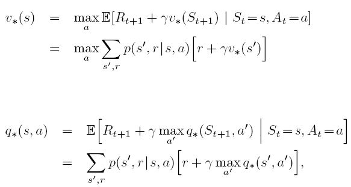

DP算法会把Bellman等式用来当作更新规则，以便可以提升我们对价值函数的估计准确度。

# 4.1 策略评估(Policy Evaluation)--Prediction

策略评估意思就是我们要对于任意一个策略

计算他的state-value function。我们也可以把这个当作一个预测问题(prediction problem)，
就是给我们一个策略，来预测在每个状态时的state-value function是多少。

上一章哦我们得出了Bellman equation，如下：

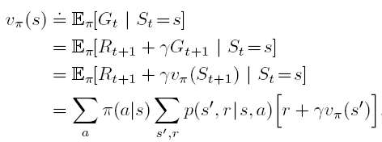

这里的下标

表示的就是对于所有的状态，都是按照这个策略来进行选择。策略就是起一个指导作用。

同时上一章也介绍了，如果环境的dynamics完全已知，那么上面的Bellman equation表示一个n元1次方程组，
是可以通过解方程组计算的。只是可能状态空间太大，导致计算量太大了。
所以我们更希望可以迭代计算(**Iterative solution**)

假设我们有一个近似value function的序列：
……，每个都是一个从状态空间
到一个实数的映射。

假设初始值

是任意选取的，但是注意所有的terminal state的value必须设置为0。
每一次都是使用Bellman equation对

进行估计的，更新规则(update rule)就是Bellman equation。可得update rule为：

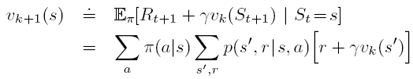

最终，只要保证

存在，
序列
{

}
会收敛到

，这个算法被称为迭代策略评估算法(**Iterative policy evaluation**)。

为了可以从

估计

，我们迭代策略评估方法对于每个状态s，都使用从旧的值和immediate reward得到的新的值来替换旧的值。
我们叫这种操作为期望更新(**expected update**)。之所以称为期望更新是因为所有的更新都是基于所有下一步可能的状态的
期望来更新的，而不是仅仅对下一个状态进行采样。

具体来讲，比如我们下象棋，现在处于某个状态。我们怎么来更新这个状态的值呢？是把下一步可能到达的状态的价值和immediate reward求一个期望，
而不是在所有可能的状态中随便选择一个，然后用这一个的价值加上immediate reward得到的。这就是expected的含义。

为了实现迭代策略评估，我们可以准备两个数组，一个用来记录所有旧的值
)
，另一个记录所有新的值
)
。更新的时候就是把旧的值按照概率求一个期望来更新新的值，旧的值保持不变。

我们还可以进行原地操作(in place)。就是直接把新的值覆盖旧的值。这样就会出现一种情况，某个状态的更新可能用到了别的状态的新的值。
实际上这种方法的收敛速度更快，实际实现的时候也是采用in place的方法实现的。

那算法到什么时候停止更新呢？一般来讲是到所有值完全不变的时候停止，但是实际上我们是在最大的更新还是比较小的时候就会停止了，具体的
算法见下面的伪代码：

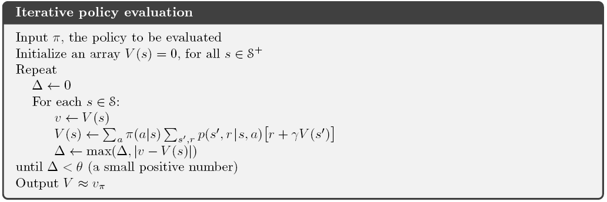

# 2. 策略提升(Policy Improvement)

按照上面的策略评估方法，我们可以对不同的状态值在某个策略下的值函数计算出来。
我们之所以计算对于一个policy的值函数的原因就是为了找到更好的策略。

假如我们现在有了在某一个策略

下的值函数

。我们想知道，比如状态s，我们是不是应该改变s处的策略，让状态s的值函数大一点。其实就是是不是
应该选择
)
。我们现在知道在当前的policy 

下状态s的估值是
)
，但是如果换成一个新的policy结果会变好还是变坏呢？

一种方法是考虑在状态s下，选择动作a，然后在使用当前的policy 

。如下面的公式所示。

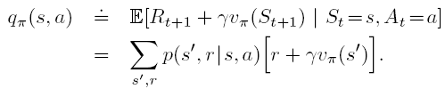

这个公式其实可以根据backup diagram很容易的看出。

因此我们这时候只要比较这个
)
是不是比
)
更大。如果更大的话，那就好了，说明我们在状态s选择动作a，然后再按照原来的策略继续选择，
会更好，因为估值更大。这就是说，以后我们最后遇到s就选择动作a，这样至少比原来要强。

因此我们可以得到“策略提升理论”(**policy improvement theorem**)：
+ 如果对于所有的状态s，都有

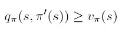

那么说明policy

比policy

更好。

因此我们说一个策略比另一个策略好，就是说在任何状态下按照这个策略的估值都不比另一个策略的差。
用公式表示就是，对于所有的状态s，满足
>=v_{\pi}(s))

这个可以由上面的policy improvement theorem证明，证明过程如下：

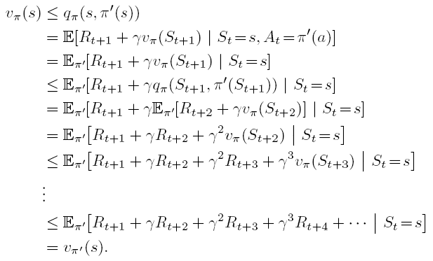

这个证明很容易理解。基本思路就是在每个状态使用新的策略选择动作都不比使用原来的策略差。

现在，假设我们给定了一个policy和对应的value function，我们就可以评估对于一个给定的状态，
选择一个确定动作的好坏，就是通过上面的
=\sum_{s',r}p(s',r|s,a)[r+\gamma v_{\pi}(s')])
来计算。因此我们要把这种情况进行扩展，扩展到在每个状态下对于每个动作的选择的好坏。换句话说，我们完全得到了一个
新的greedy的policy，
。计算方法如下：

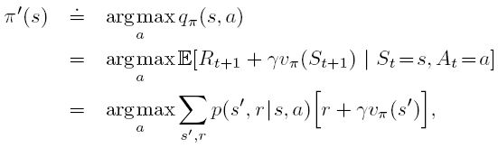

这里我们通过使用原始策略的值函数，贪心的得到了一个新的策略，这个过程就是“策略提升”(**policy improvement**)

但是有一种情况就是，我通过贪心得到了一个新的策略，发现在这个新的策略下，各个状态的值函数没有一个比原来的更好的，
因为根据上面的证明，这个新的策略不可能比原来的更差，因此这时就是

。这时，可以得到：

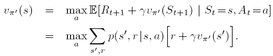

这其实就是**Bellman optimality equation**。并且此时

都是最优策略。

这一节我们使用的是确定性策略(**deterministic policies**)，就是我们认为在某个状态就应该选择一个确定的动作。
但是一般情况下是一个随机性策略(**stochastic policy**)，
)
。这是在s状态下选择动作a的概率。事实上随机性策略也可以按照上面的方式很容易得到。
所有的结论对于stochastic policy都是适用的。

#3. 策略迭代(Policy Iteration)

现在假设我们有一个策略

,我们可以根据策略评估方法计算

，然后根据在这一policy下的值函数，使用policy improvement方法得到一个更好的策略
，
然后计算在新的策略下的值函数

，然后再使用policy improvement找到一个更好的策略，这样下去我们就可以不断去改进我们的策略了。

可以用下面的图示表示这一策略迭代过程(**policy iteration**)

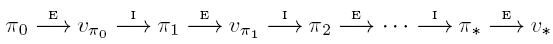

其中E过程表示的就是**policy evalution**，I过程表示的就是**policy improvement**。由于有限MDP只有有限的策略数量，
因此最终一定会在有限的迭代次数内收敛到最优策略和最优值函数。

下面的算法给出了具体的policy iteration过程。

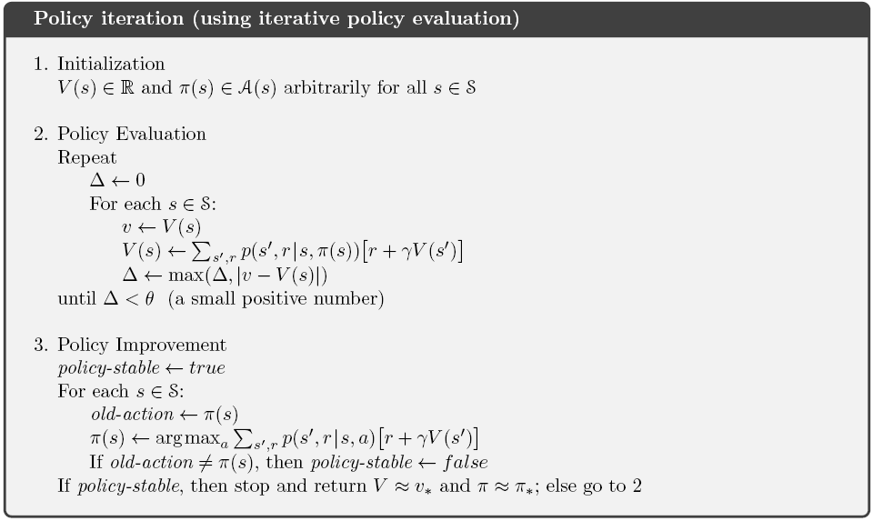

实际policy iteration可能只需要很少的几次迭代就可以收敛。

# 4. 值迭代(Value Iteration)

Policy iteration的一个缺点就是每次迭代都需要进行policy evaluation，而这个policy evaluation可能需要扫多遍的状态集。
我们知道迭代进行policy evaluation的时候，最后价值函数是可以收敛的。但是如果我们在没收敛的时候就直接停止评估，然后直接
进行policy improvement呢？让我们看下面的这个策略评估的例子。

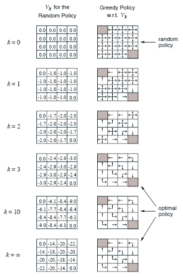

在这个例子中，我们发现，在k=1,2,3的时候，策略在发生改变，但是k继续增大时值函数还在变化，说明值函数没有收敛，但是
最优策略已经不会发生变化了。这说明我们如果从k=3就停止evaluation，那么greedy policy的结果也是不变的。

实际上，policy evaluation可以在几步之后截断(**truncated**)同时最后还可以保证policy iteration收敛。其中的一个特例就是
我们只扫一次（每个状态只更新一次）就直接停止。这种方法称为值迭代(**value iteration**)。

下面的一个简单的更新就联合了policy improvement和truncated policy evalution：

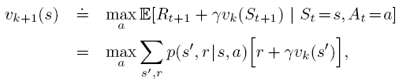

对于任意的值函数初始值

，序列{

}都可以收敛到

，只要保证

存在。

另外一种理解value iteration的方式是使用下面的Bellman optimality equation。

=\underset{a}{max}\sum_{s',r}p(s',r|s,a)[r+\gamma v_*(s')])

value iteration可以看作是根据上面的这个Bellman optimality equation变成的更新规则。

注意value iteration的更新等价于policy evaluation的更新，除了value iteration的更新需要取所有action中的最大值。

我们也可以通过比较policy evaluation和value iteration的backup diagram来看一下区别与联系。

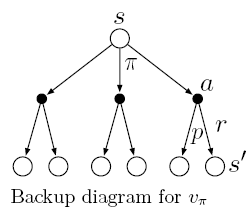

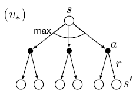

第一个图是policy evalutaion的backup diagram，我们根据policy来对结果求期望；
第二个图是value iteration的backup diagram，这个就是对actions找了一个最大值。
这两个图都是第三章上面的图。

value iteration终止的方式和上面的policy iteration差不多，具体value iteration算法的伪代码表示如下：

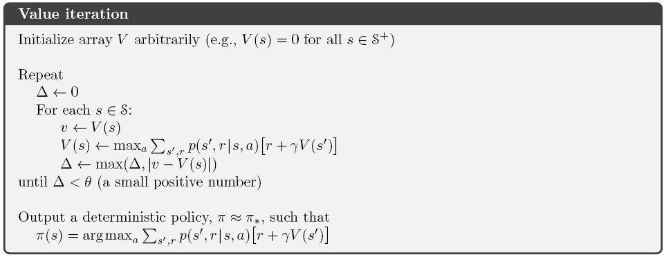

value iteration十分高效，它的一次sweep相当于之前的一次policy evaluation和一次policy improvement。

# 5. 异步动态规划(Asynchronous Dynamic Programming)

动态规划方法的一个主要缺点就是需要遍历整个状态集合。这就是说如果状态集合太大的话，可能计算机在可忍受时间内根本运行不出来结果。
异步动态规划(Asynchronous Dynamic Programming)是一种in-place的迭代DP算法。它不是去sweep整个state set。而是选择一些state进行
更新。可能有些状态还没更新一次的时候，另一些状态已经更新了好几次了。Asynchronous DP算法可以灵活的选择一些state来更新。
同时，异步DP可以用于实时交互的场景下。比如我们可以更新用户经常遇到的状态，对于其他的state做比较少的更新。

# 6. 泛化的策略迭代(Generalized Policy Iteration)

Policy iteration包括两个同步的(simultaneous)、交互的过程：policy evaluation目的是使value function和current policy一致，
policy improvement目的是根据当前的value function贪心的选择policy。

在policy iteration中，这两个过程使交互进行的，但是实际这并不一定是必须的。比如在value iteration中，在两个policy improvement之间，
只有policy evaluation的一次迭代。我们使用(**Generalized Policy Iteration, GPI**)来表示这种policy evaluation和policy improvement
交互的过程，不考虑两个过程的间隔、顺序或者其他细节。几乎所有的强化学习算法都可以被描述为GPI过程。如下图所示。

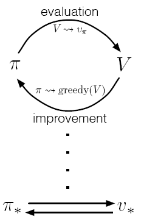

Evaluation和improvement这两个过程可以看作是竞争与合作的过程，他们的目标完全是两个相反的方向。根据当前的value function做improvement其实
是greedy的选择policy，为了让value不再适用于新的policy。而evaluation就是根据这个新的policy去改变value function，使value function与这个新的
policy保持一致。好像improvement过程是要让policy甩掉value function，而evaluation就是让value function跟上policy。最终policy发现自己已经提高不了了，
value function发现自己也不用怎么改变了，这个时候就收敛到optimal policy和optimal value function了。相当于是
两个人在相互竞争的过程中共同达到了最优。可以用下面的这个图说明这个过程。

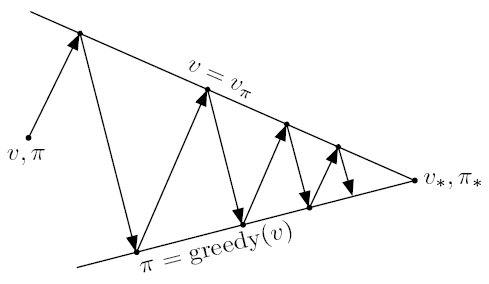

# 7. 动态规划的高效性(Efficiency of Dynamic Programming)
虽然说DP不能解决状态空间很大的问题，但是实际它还是非常高效的，因为DP方法找到optimal policy是与状态和动作个数多项式相关的。
假如有n个状态，k个动作，DP算法可以在大小为
的策略空间中，以k和n的多项式时间找到optimal policy。
线性规划可以用来解决MDP问题，但是当状态数比较多的时候就不太现实了。因此对于大的问题，只有DP方法是可行的。

而DP方法的限制实际是维度灾难，就是其实状态空间的个数是随着状态变量的个数指数增长的。对于大状态空间，异步DP会是一个不错的选择。

我们这一章提到的估计的更新，都是建立在其他的估计的基础之上的，这被称为**bootstrapping**。意思就是基于其他的估计去进行我们的估计。
bootstrapping在强化学习中用处很广，甚至我们不能完全了解environment都进行bootstrapping。

---

# 编程练习

# 1. (杰克的汽车租赁) Jack's Car Rental

## 描述：
Jack在两个地方有汽车租赁公司。客户租赁一辆汽车需要支付10美元。Jack为了保证每个公司都有车，他在晚上在两个公司之间移动汽车，
移动1辆汽车需要花费2美元。

我们假设每个公司的租用和归还的汽车数量都服从泊松分布，假设在请求租赁的客户数的
分别是3，4；
归还租赁的客户数：
分别是3，2。
假设每个公司的汽车总数不超过20辆（如果用户归还车辆之后超过了20辆，则忽略这些多余的车辆，这么做是为了简化问题。）
从一个地方运往另一个地方的车辆不超过5辆。

## 建模
可见这是一个continuing finite MDP问题。我们假设

。
+ 状态：每个公司一天结束时候车辆的个数
+ 动作：晚上两个公司运车的个数

这里我们使用policy iteration和value iteration两种方法来解决该问题。首先需要先进行预处理，然后再使用算法来
计算。代码参考了[项目](https://github.com/zswang666/Jack-Car-Rental-using-Policy-Iteration)
。我自己实现的代码见[代码](../codes/4_Dynamic_Programming)
