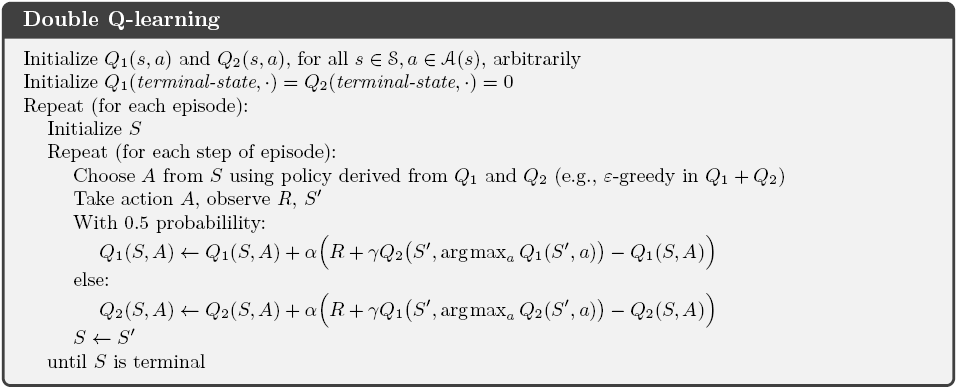

# 时序差分学习 (Temporal-Difference Learning)

---

如果说强化学习中存在一个最核心的概念，那一定是时许差分学习，又称为TD learning。

TD learning是MC思想和DP思想的结合。它可以像MC方法似的直接从raw experiment中学习，也可以像DP方法一样基于之前的估计进行新的估计，
而不用像MC一样必须等到一个episode结束才能更新。

一般情况下，我们首先关心的是policy evaluation，也就是prediction problem，就是给定policy估计value function。
对于control problem，目的是找到一个optimal policy，此时DP、TD、MC方法都是GPI问题的变体。
这三种方法的主要不同之处就是prediction的方法不同。

# 1. TD预测 (TD Prediction)
一个简单的every-visit MC方法用于nonstationary environment的公式为：

这种方法被称为常数步长的MC方法(

MC)。

从上式可以看出，MC方法必须等到episode技术才可以增量更新V，因为需要等到

已知才可以。而TD方法只需要等到下一个time step就可以。

在t+1时刻，我们立刻就得到了一个target，就是使用observed reward

和估计值

来更新V。最简单的TD更新形式为：

MC的target是

，就是MC是朝着累积奖赏的方向更新的。而TD是朝着立刻得到的target，就是
)
，这种TD方法称为**TD(0)**，或者一步TD(**one-step TD**)，
因为这个方法是
)
和n-step TD方法的特例。

下面给出TD(0)的伪代码形式如下：

我们可以根据第三章知识得到：

这里，MC方法是把第一个等号作为了target，而DP则是把第三个等号作为target。

MC方法的target是一个估计是因为式子中的期望未知，需要估计期望；
DP方法的target是一个估计并不是因为期望，因为期望是可以精确计算的，因为给出了环境的状态转移。
它之所以是一个估计是因为
)
是未知的，这里是使用当前的估计：
)来估计的。

TD target是一个估计就有上面两点原因:采样期望值，同时使用当前估计V，而不是true 

。因此，TD方法结合了MC的sampling和DP的bootstapping。

下面给出TD(0)的backup diagram：

TD和MC的更新方式称为采样更新(sample updates)，DP的更新方式称为期望更新(expected updates)。
sample updates意思就是需要涉及向前走去采样记下来的状态(successor state)。

在上面的伪代码中，可以看到括号内的差值(difference)，是状态

的estimated value，和在向前看了一步之后的better estimate
)
，这个差值称为TD误差(**TD error**)。这个TD error会以各种形式在强化学习中出现：

注意，在每个时刻的TD error是实时得到的(made at that time)，因为TD error依赖于next state和next reward。
如果不look ahead，我们是不能得到这两个的。这就是说

是状态

的值估计
)
在t+1时刻得到的误差(error)。

注意，如果在一个episode期间，V数据保持不变的话，那么MC error可以写成TD error的和，如下所示：

这个推导不太准确，原因是TD(0)的在episode期间会更新的，只能说如果step size很小的话，V可以保持大概不变(hold approximately)。

上面这个推导的泛化在TD learning中起到了重要作用。

TD learning就是要在采样的过程中，对于当前不太准的估计进行及时更新。下面举一个形象的例子来说明这个过程。

这个例子就是开车回家的例子(Driving Home)。
每天下班后你都会开车从公司回家，因此你想要预测什么时候能到家。当你离开办公室后，你考虑了今天是周几、天气如何、是不是晚高峰以及其他相关的因素,
最后你估计你需要30分钟的时间到家。这时你看了一眼表，正好6点整。

然后你从公司走到停车场找到你的车，这时看了下表，6:05，但是这时开始下雨了。你知道下雨的话车走的就慢了，还可能堵车，
因此你重新估计了时间，你觉得从现在开始还需要35分钟才能到家，或者说总共需要40分钟（加上刚才找车的5分钟)。

15分钟后你走完了高速，一路还比较顺畅。这时候你走上辅路准备回家，你觉得快到了，因此你现在觉得总过用35分钟就能到家了。

但是这时你发现你正跟着一个大卡车，这个大卡车把路占满了，因为路比较窄，还不能超车。因此你只能跟着这个大卡车。
最后6:40终于换到另外一条路上了。3分钟后你到家了。

上面的过程可以用下面的表格表示

我们设置disouting

。因此每个状态的return就是从这个state开始的actual time。每个状态的value就是期望要走的时间。
表格的第二列数字给出了遇到每个状态的current estimated value。

我们把最后一列数字，就是你预测的总共花费的时间画成折线图。看下MC方法是如何操作的。

上图折线上的点表示每个状态下我们对于总花费时间的估计。虚线表示实际用时，也就是MC方法的target，最后的return。
在完成这个episode之后，就是更新每个state的value的时候了。比如在leaving office状态下，我们估计的耗时是30分钟，
而实际是43分钟，这说明我们的估计不合理啊，因此根据上面的constant alpha MC方法，假设

，则更新当前的估计为V(leaving office)=43。

所以图中的箭头就是prediction的改变值。

比如在离开高速公路时，我们估计的总耗时是35分钟，但实际却用了43分钟，中间差了8分钟。如果step size是0.5的话，那最后我们的估计就要增大4分钟。
这个其实是一个比较大的更新，可能跟在大车后面只是一个偶然事件。

使用MC方法，所有的改变必须是离线的(off-line)的，就是必须到家之后才能更新，因为只有到家了才知道actual return。

但是等到最后的结果出来再开始学习真的有必要么？比如又有一天你从公司出来，估计30分钟能到家，但是你在高速公路上堵车了，
现在你估计可能得用50分钟才能到家了。在你堵车的时候你没事就会想，是不是之前我估计的30分钟太乐观了。。。

所以我们必须要等到到家了才能更新么？MC方法下你必须这么做，但是TD learning方法下你不用等到回家再更新。

按照TD方法，你可以立刻把初始状态估计的30分钟向着50分钟移动一点。

下面的图给出了之前开车的例子使用TD方法的TD规则的prediction的更新过程：

每个error按照一定的比例去更新prediction，这就是在prediction中的时序差分(Temporal Difference)。

# 2. TD预测方法的优势(Advantages of TD Prediction Methods)

TD方法利用猜测进行猜测(learn a guess from a guess)，也就是bootstrap。那么TD方法比起MC和DP方法有什么优势呢？

首先，TD比DP方法的一个优势就是TD不要求environment model。

另一个TD方法比DP方法的一个优势是TD方法容易on-line的实现，不用等到一个episode结束再更新。这个有时是一个十分重要的优势，
因为有些application的episode很长，如果等到这个episode结束再更新就太慢了。还有些应用是continuing task，要是MC方法就得使用discount episodes等。
学习较慢。但是TD方法不管你episode是不是无穷，长度是多少，我只需要看你下一步转移到哪就行了。

虽然我们使用one guess来估计value确实方便，但是这种方法能保证收敛到正确的结果吗？答案是yes。
对于任何固定的policy

，TD(0)已经被证明可以收敛到

如果TD和MC方法都能收敛到correct predictions，那么我们应该首先选择哪种方法呢？
目前没有人能从数学上证明一个方法比另一个收敛的快。但是实际上，TD方法一般在stochastic tasks上比constant-alpha MC收敛的快。

下面举例说明。下图表示了一个马尔科夫奖赏过程(Markov reward process, MRP)：

MRP其实就是没有action的MDP。下面我们使用MRP关注prediction问题。

在MRP中，所有的起始点都是中间state C。下面就是每步等概率的选择向左或者向右走。最后的终态是方块，走到左边的方块则return为0，
走到右边的方块则return为1。并且这个task是undiscounted的。每个状态的true value就是从当前状态走到右边状态的概率。
因此我们很容易知道从状态A到E，这5个state的true value分别是
。

下面给出使用constant step-size为0.1时候的TD(0)方法。在不同的episode更新之后的结果如下图所示：

可以看出在100个episode更新之后估计的值越来越接近true value。

下面的图展示了不同alpha下MC方法和TD方法的估计值与true value之间的均方根误差(root mean-squared error, RMSE)。

上面的估计初始值都是0.5，从上图可以看出TD方法比MC方法效果要好。并且还有一个现象就是越往后的episode，波动越明显。

# 3. TD(0)的最优性(Optimality of TD(0))

这一节目的是说明TD(0)得到的value的估计比MC方法得到的估计要好。

假设我们的episode个数是有限的，并且time step是有限的。对于任何一种方法，更新规则都是new = old + alpha * (target - old)。
之前是每看到一个state就更新一次，下面考虑一种新的更新方法，叫做批量更新(batch updating)。

Batch updating就是我看整个的batch of episodes的数据，然后观察每个state的所有的increments，其实就是target-old。
原来是每次见到都更新，现在是只更新一次，就是把所有的increments求和，然后统一更新，这样每个state只需要更新一次。
这样反复看整个training set，直到收敛。

因此，之所以称为batch updating，就是因为更新只会发生在看完所有的batch of training data之后才进行。

使用batch updating，TD(0)和constant-alpha MC方法再满足alpha足够小的情况下都一定(deterministically)可以收敛。
但是两种方法可能收敛到不同的结果。我们需要理解为什么收敛到的结果是不同的。

下面先给出上面的random walk的batch updating的版本的结果图。

在batch training下，constant-alpha MC方法通过所有visti state s的actual returns来计算sample average，作为状态s的估计。
这种方法是通过最小化训练集中的actual returns的均方误差(MSE)来进行估计的。

那为什么TD(0)的估计结果要好于MC方法呢？是因为MC方法只是在有限的数据内(in a limited way)是optimal的。
而TD方法的估计是与预测未来的returns相关的。

举个例子来说，假如我们得到了以下8个episodes，这些来自一个unknown的MRP：
+ A, 0, B, 0
+ B, 1
+ B, 1
+ B, 1
+ B, 1
+ B, 1
+ B, 1
+ B, 0

首先我们很容易对state B给出估计，就是3/4。因为总共8次访问了B，6次为1。

关键是如何估计state A的value。

按照batch TD(0)的思路：A转移到B的概率是1，我们知道了B的估计是3/4（其实也可以先看A，只是在更新完B之后又要更新A了，因为要达到收敛），
所以A的估计就是V(A) = 0 + 1 * (3/4 + 0 - 0) = 3/4。

按照batch MC的思路，我们在这个batch中只见过一次A，得到的actual return为0，因此我们估计V(A)=0。

batch MC方法最小化了MSE，能够实现在training data上的0误差。但是我们仍然会人为batch TD的估计更好。
如果这个过程是Markov过程的话，我们认为TD方法能够使future data的误差更小，而MC方法能够使existing data的误差更小。

从上面的例子可以看出，batch TD(0)和batch MC的估计一般是不同的。batch MC更希望最小化训练集上的MSE来进行估计，
batch TD(0)方法总是要找出对于Markov的最大似然模型来说完全正确(exactly correct)的估计。

给出这个model，如果model是exactly correct的，那么我们估计的value function也是exactly correct的，这个叫做**certainty-equivalence estimate**，
因为这个方法相当于在假定对潜在过程(underlying process)的估计是已知的而不是近似的情况下的估计。一般情况下，batch TD(0)能收敛到certainty-equivalence estimate。

这就可以解释为什么TD方法比MC方法收敛的更快了。在batch的形式下，TD方法更快是因为它直接计算的是true certainty-equivalence estimate。

但是实际certainty-equivalence estimate是没有价值的，因为计算这个是不可行的。
因此在有很大状态空间的task上面，TD方法可能是唯一可行的近似certainty-equivalence的解决方案。

# 4. Sarsa: 同策略TD控制(Sarsa:On-policy TD Control)

现在我们希望将TD方法用于control problem。在MC方法中，我们遇到了exploration和exploitation的tradeoff问题，
然后得到了两种主要的解决方法：on-policy和off-policy。这一节我们要说的是on-policy TD control method.

首先，我们要学习的不是state-value function，而是action-value function。就像我们在MC方法中说的是的，
如果我们只有state-value function，我们还是不好得到策略。而如果有action-value function，那么我们只要找在当前状态s下，
argmaxQ(s,a)的动作就行了。因此这里我们必须估计在当前policy

下的
)
。因此我们需要把原来的state序列换成state-action pair序列。

在上一节的TD prediction时候，我们考虑的是从state到state的转移，然后学习state的value。而现在我们要考虑的是state-action pair
到state-action pair的转移，然后学习state-action pair的value。因此我们可以得到下式：

Sarsa的back diagram为：

如果

是terminal，则
=0)
。

上面的更新规则需要一个五元组(quintuple):
)
，实际就是State, Action, Reward, next State, next Action，因此称为Sarsa算法。

Sarsa算法的伪代码形式如下：

对于episode很长的问题，MC方法会比较慢，因为它需要等到termination才能开始update。而Sarsa算法没有这个问题，因为它是step-by-step的learning method。

# 5. Q-learning：异策略的TD控制(Q-learning: Off-policy TD Control)

Q-learning是一种非常重要的方法，早期的强化学习发展主要依靠的就是off-policy TD control algorithm，就是Q-learning。
Q-learning的update rule如下：

这里action-value function，Q，直接估计optimal action-value function

。Q-learning的backup diagram如下：

Q-learning的伪代码如下：

# 6. 期望Sarsa(Expected Sarsa)
Expected Sarsa是可以是on-policy的也可以是off-policy的。这里我们介绍的是on-policy的expected sarsa。

考虑与Q-learning相似的方法，只是next state-action pairs不是用最大的value来计算，而是计算expected value。
因此可以得到这一算法的update rule：

给出下一状态

，算法将会想Sarsa一样朝着期望的方向移动，因此称为Expected Sarsa。它的backup diagram如下图所示：

Expected Sarsa比Sarsa计算起来更加复杂，但是消除了

的variance。给定相同数量的experience，Expected Sarsa比Sarsa要稍微好一点。

# 7. 最大化偏差和双倍学习(Maximization Bias and Double Learning)

这一章所有的控制算法都涉及到在target policy的某种构造(construction)上最大化。
比如Q-learning的target policy是根据当前action value的greedy policy，就是最大化action value；
Sarsa通常是epsilon-greedy的也涉及到最大化操作。

在这些算法中，在估计值上的最大值被隐式的当作最大值的估计。其实这会导致正偏差(positive bias)。
比如我们只有一个状态s，有许多动作a，这些动作的true value q(s,a)都是0。但是在估计的时候，我们的估计值Q(s,a)是一个在0上下波动的结果。
因此true value的最大值是0，而估计值的最大值是一个正值，因此有一个positive bias，我们称为最大化偏差(maximization bias)。

有没有可以避免maximization bias的方法？首先，我们考虑一个已经估计了每个action的value的bandit问题。这个估计是通过平均多次的reward得到的。
通过上面所述，我们知道如果我们使用估计的最大值去作为true value最大值的估计时，会存在一个positive maximization。

之所以出现这个问题我们可以认为我们用同一个样本集既决定maximization action，又用来估计value。假如我们把集合分成两个集合，
分别使用着两个进行独立的估计，分别是
,Q_2(a))，每个都作为true value q(a)的一个估计。
我们可以使用其中的一个估计，

去确定最优动作
)
，然后使用另外一个估计

给出value的估计
=Q_2(argmax_aQ_1))
，这时Q2就是无偏估计，因为
]=q(A^*))
。我们也使用类似的过程调换角色给出Q1的无偏估计：
)
，这就是双倍讯息学习(double learning)。

注意，尽管我们做了两个估计，但是每次其实只是更新一个估计，因此double learning需要双倍的memory，但是不需要双倍的计算时间。

将double learning扩展到full MDP上，举例而言，可以根据Q-learning得到类似的Double Q-learning，更新公式为：

然后有一半得概率把Q1，Q2交换，就是更新Q2。更新过程完全与上式对称。

该算法消除了maximization bias。下面给出Double Q-learnig的完整算法：

当然，很容易也可以得出Sarsa和Expected Sarsa的double版本。

# 8. 游戏、后状态、其他特例(Games, Afterstates and Other Special Cases)

一般的state value function是估计agent将要选择动作时所处的状态，而有些时候（比如第一章的tie-tac-toe），
是对agent选择完动作的state进行估计，这叫做后状态(**afterstate**)，afterstate的值函数称为后状态价值函数(afterstate value functions)。
Afterstates在我们知道环境的初始的状态转移时候（而不是全部的状态转移）是很有用的，最典型的例子就是游戏。
比如一个棋类游戏，我们很容易知道我们选择完一个动作之后，会转移到哪个状态，这时不需要知道对手怎么下棋。
这时使用afterstate value function是一个高效的学习方法。

之所以高效在tic-tac-toe中是比较明显的，因为传统的action-value function就是将position和moves映射到一个value。
但是其实很多position-move pairs会得到同一个position，比如下面的图：

上图的两个position-move pairs不同，但是得到相同的"afterposition"，因此一定有相同的value。

传统的action-value把上面两种情况分开来看，而afterstate value function则会把这两种看作一种情况。

当然afterstate并不是只能用在game上面，也能用在其他的special case，比如排队问题等。

# 9. 总结(Summary)

这一章主要介绍了时序差分学习(TD learning)，为了能保持足够的exploration，可以使用on-policy和off-policy方法。
当然还有第三种方法可以保持充分的exploration，叫做actor-critic方法，将会在第13章介绍。

TD方法可以应用到on-line的环境中，可以直接与环境进行交互。后面我们将会进一步扩展这些方法。

这一章讲的TD方法是一种TD的special case，被称为一步、表格、免模型TD方法(**one-step,tabular,model-free**)方法。
下面两章我们将探索多步的形式(multistep forms)，与MC方法相联系或者与DP方法相联系。在书的第二部分，
将会探索function approximation的形式，而不是表格的形式，这就可以与deep learning和ANN联系起来。